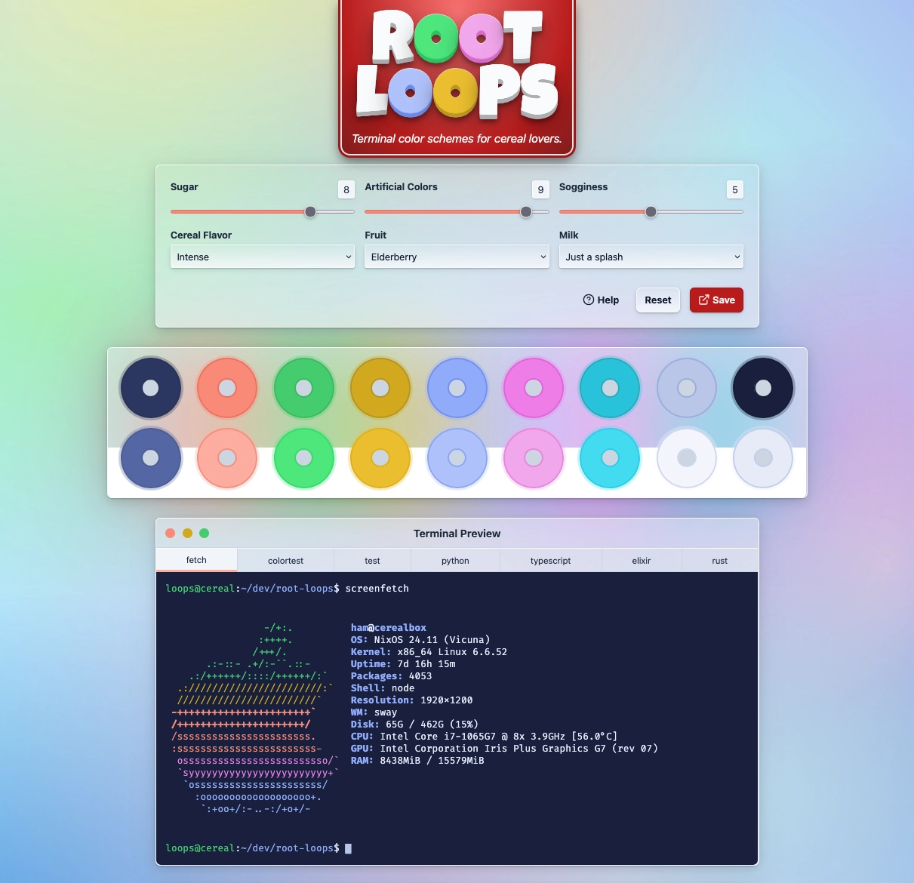

[](https://github.com/hamvocke/root-loops/actions/workflows/test.yaml)

# Root Loops 🔴🔵

_Spiffy terminal color schemes, as simple as pouring a bowl of cereal_

## What is this?

Beautiful terminal color schemes are a proven way to increase your productivity by a huge margin. In the past, developers had to rely on ordinary, off-the-shelf color schemes to spice up their terminal experience. Root Loops allows you to generate your very own beautiful color schemes according to your personal taste. Bland or vibrant, dark or light, you decide!

[](https://rootloops.sh)

<p align="center"><strong><a href="https://rootloops.sh">👉 Create your own terminal color scheme here</a></strong></p>

> [!CAUTION]
> Any actual productivity gains from using Root Loops are purely coincidental. You get to flex with your own color scheme in front of your nerd friends, though.

## Development

Install dependencies via `npm install`.

Start a development server:

```bash
npm run dev

# or start the server and open the app in a new browser tab
npm run dev -- --open
```

### Building

To create a production version of your app:

```bash
npm run build
```

You can preview the production build with `npm run preview`.

### Testing

Unit tests run locally using vitest:

```bash
npm run test:unit
```

E2E tests run via Playwright. You can try to install it locally and run the tests natively:

```bash
npx playwright install --with-deps # only need to run this once
npm run test:integration

```

If that doesn't work (it doesn't work on non-LTS Ubuntu systems, for example) try running stuff in a container:

```bash
npm run test:integration-docker
```

Playwright tests will start your application automatically.

### (Re-)Generating Terminal Snippets

To demonstrate what the root loops color scheme looks like in action, we provide a couple of sample terminal outputs in the `snippets/` directory. The `generate-ansi-snippets.js` script in the `snippets/` directory makes sure to generate a bunch of ANSI-colored terminal output, via different means:

1. by runnig `bat` against the provided sample code files (e.g. `python.py`, `elixir.ex` or `typescript.ts`)
2. by running `screenfetch` on the host OS
3. by running a dummy test suite via `vitest`

In order to run this script, make sure you've got `screenfetch` and `bat` installed on your host OS, and then run:

    cd snippets/
    node generate-ansi-snippets.js

This will update the `src/lib/snippets.ts` file in place, which is the file we use to render terminal output samples in the root loops app.
